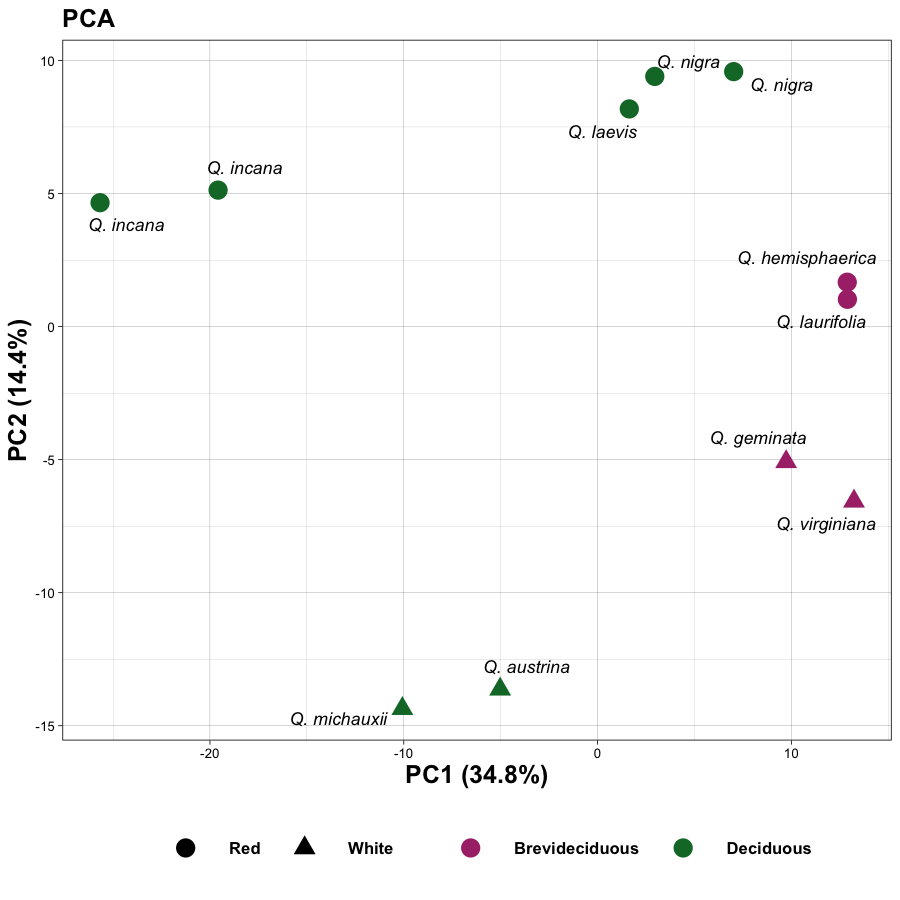
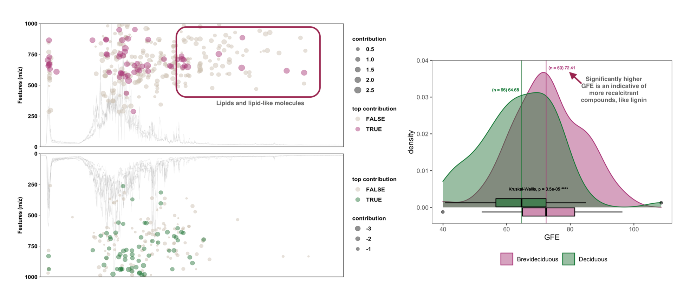

*Manuscript in prep.*

This is a project in collaboration with Dr. Jana U'Ren (University of Arizona).

**LC-MS/MS-based metabolomic approach revealed different metabolic profiles of oak species**

# Contents

- [1 - Introduction](#1---introduction)
- [2 - Summary of methodology](#2---summary-of-methodology)
- [3 - Summary of analysis pipeline](#3---summary-of-analysis-pipeline)  
        [3. 1 - Preparing metadata](#1---preparing-metadata)  
        [3. 2 - Preprocessing](#2---preprocessing)  
        [3. 3 - MS2 Annotation with GNPS and SIRIUS](#3---ms2-annotation-with-gnps-and-sirius)   
        [3. 4 - Multivariate Analyses](#4---multivariate-analysis)  
        [3. 5 - Gene-metabolite integration with MAGI](#5---gene-metabolite-integration-with-magi)  
- [4 - Brief summary of results](#4---brief-summary-of-results)
- [5 - Final considerations](#5---final-considerations)
- [References](#references)

---
## 1 - Introduction

Despite increasing accessibility of multi-omics technologies, integration of multi-omics data in analysis pipelines remains a challenge especially in the environmental field. In addition, there are still many associated bottlenecks to overcome in metabolomics.

Untargeted tandem mass spectrometry by Fourier transform Ion Cyclotron Resonance preceded by liquid chromatography (LC-FTICR-MS/MS) is a high-throughput and sensitive metabolomics technique that yields high mass accuracy. Such experiments produce information-rich datasets that require the use of many software programs of different programming languages for data analysis. This problem is exacerbated by integrating multi-omics data with metabolomics because of the data heterogeneity. Therefore, **our goals** in this study were two-fold: i) demonstrate the capabilities of LC-FTICR-MS/MS for metabolic profiling, and ii) to develop a data analysis pipeline for a complex and non-model organism, oak (*Quercus* spp.).

---
## 2 - Summary of methodology

Tandem mass spectrometry was collected on a 21 Tesla (21T) Agilent FTICR-MS equipped with a Waters ultra-performance liquid chromatography system. Negative mode raw chromatography data were preprocessed using the R package XCMS (Benton et al., 2010; Smith et al., 2006). Fragmentation spectra (MS/MS or MS2) were searched against the GNPS High-Throughput Dereplication Comprehensive MS/MS Libraries (Wang et al., 2016). The remaining unannotated spectra were annotated *in silico* using Sirius command-line v.4.5 (Dührkop et al., 2019). Downstream multivariate statistical analyses were conducted with features with MS2 that received at least a molecular formula assignment. Genome-metabolome integration was done using MAGI (Erbilgin et al., 2019). The predicted amino acid sequences of the *Q. robur* reference genome (Plomion et al., 2018) were used in order to unveil potential reactions between the metabolites and genes.

---
## 3 - Summary of analysis pipeline

Scripts and notebooks will find here, and briefly what they do. They should be run in this order as well.

*Before you say it... I am not crazy. Directories 4_ and 5_ were other analyses that are not gonna make it to the final paper, ok?!*

### 1 - Preparing metadata
[`./0_metadata/0_make_metadata.ipynb`](./0_metadata/0_make_metadata.ipynb)
In this script, I merge the metadata from Dr. U'Ren, and added filenames and sample codes for the `xcms` analysis.

### 2 - Preprocessing
[`./1_preprocessing/0_data_import.Rmd`](./1_preprocessing/0_data_import.Rmd)
This script imports the `.mzXML` data files, and saves the raw data into `OnDiskMSnExp` object as `.RData`. It takes around 20 minutes to import all data files, so this saves me some time importing data in case I need to go back and redo the analysis from scratch.

Important: these data were exported from the mass spectrometer in centroid mode.

[`./1_preprocessing/1_pre-processing.Rmd`](./1_preprocessing/1_pre-processing.Rmd)
Preprocessing consisted of four steps: i) detection of chromatographic peaks across the 3D chromatograms, ii) retention time adjustment to correct for instrumentation shifts, iii) grouping chromatographic peaks across samples into features, and iv) filling in missing intensity values of peaks based on the original chromatograms.

Chromatographic peak detection was done using the *centwave* algorithm (Tautenhahn et al., 2008). Retention time adjustment (i.e., alignment) was performed using the *peakGroups* algorithm (Smith et al., 2006). Matching and grouping chromatographic peaks across samples into features (i.e., correspondence) was performed using the `groupChromPeaks` function (Smith et al., 2006). The last step in the preprocessing, filling in missing intensity values, step was done using the `fillChromPeaks` function (Smith et al., 2006) by using the median width of all chromatographic peaks. Fragmentation mass spectrometry consensus spectra (MS2) were extracted as a mascot generic format (i.e., .mgf) using the custom function [`formatSpectraForGNPS`](https://raw.githubusercontent.com/jorainer/xcms-gnps-tools/master/customFunctions.R).

[`./1_preprocessing/modified_writeMgfData.R`](/1_preprocessing/modified_writeMgfData.R)
This is a support function I slightly modified from the original package. The original function exported MS2 spectra without testing the polarity of the features, so the final .mgf file always got exported as positive polarity.

In the original function, the title of the function is a long description with mean m/z and retention time. The title of each feature in the .mgf is important downstream during the SIRIUS MS2 annotation. SIRIUS gets the title as the feature identifier in the output file. So, by having the title of the mgf file as the feature identifier by xcms makes data wrangling much easier.

### 3 - MS2 Annotation with GNPS and SIRIUS
[`./2_ms2_annotation/0_fixing_GNPS_output.ipynb`](./2_ms2_annotation/0_fixing_GNPS_output.ipynb)
GNPS is a web service. I submited a job on their website and downloaded the output locally for this notebook. In this notebook, I wrestle with the output, and use `requests` to cross-reference the InChIKey with other database entries using the REST services of the [Chemical Translation Service - CTS](https://cts.fiehnlab.ucdavis.edu/).

[`./2_ms2_annotation/sirius/0_ms2_into_groups.ipynb`](./2_ms2_annotation/sirius/0_ms2_into_groups.ipynb)
I used SIRIUS command-line to annotate compounds *in silico*, and I used Atmosphere, which is a cloud-based computing resource offered by the CyVerse (Merchant et al., 2016) (National Science Foundation under Award Numbers DBI-0735191,  DBI-1265383, and DBI-1743442. URL: www.cyverse.org).

Because there are so many compounds to annotate (>1,000), and I don't want my instance to run out-of-memory, I divide the mgf file into several jobs of 5 to 10 compounds each.

[`./2_ms2_annotation/sirius/1_sirius_cli_run.sh`](./2_ms2_annotation/sirius/1_sirius_cli_run.sh)
This is the script that runs SIRIUS in `bash`...

[`./2_ms2_annotation/sirius/1_automate_sirius.py`](./2_ms2_annotation/sirius/1_automate_sirius.py)
then, I use this Python wrapper script to automate all those SIRIUS jobs. This whole thing took about half a day.

[`./2_ms2_annotation/1_fixing_SIRIUS_output.ipynb`](./2_ms2_annotation/1_fixing_SIRIUS_output.ipynb)
After SIRIUS is done running, I concatenate all the output files from those jobs, and also have to use other REST services to cross-reference SIRIUS outputs.

[`./2_ms2_annotation/2_merge_ms2_annotation.ipynb`](./2_ms2_annotation/2_merge_ms2_annotation.ipynb)
This is the last most painful part of this analysis, I promise! Here, I just merge the GNPS and SIRIUS outputs. It's important to mention that GNPS annotations have precedence over SIRIUS. So, if the one feature had an annotation by GNPS and SIRIUS, I'll discard SIRIUS annotation and let it take the GNPS annotation.

### 4 - Multivariate Analyses

All multivariate analyses were performed in R. Only features with an MS2 that received at least a molecular formula (n = 921) assignment were considered. Subsequently, raw intensity was transformed to the log-10 scale, rare features (those present in 4 or less samples) were removed, and features with low intensity variance across samples (variance less than 1) were also excluded for downstream analyses (n = 527).

[`./3_multiv_analyses/1_Dendogram/0_Dendogram.Rmd`](./3_multiv_analyses/1_Dendogram/0_Dendogram.Rmd)
Hierarchical clustering.

[`./3_multiv_analyses/2_PCA/0_PCA.Rmd`](./3_multiv_analyses/2_PCA/0_PCA.Rmd)
Good ole PCA.

[`./3_multiv_analyses/3_Permanova/0_PERMANOVA.Rmd`](./3_multiv_analyses/3_Permanova/0_PERMANOVA.Rmd)
PERM.

[`./3_multiv_analyses/3_Permanova/1_Feature_Contribution.Rmd`](./3_multiv_analyses/3_Permanova/1_Feature_Contribution.Rmd)
Making a barplot and exploring the feature contribution from PERM.

[`./3_multiv_analyses/3_Permanova/2_TIC_CloudPlots.Rmd`](./3_multiv_analyses/3_Permanova/2_TIC_CloudPlots.Rmd)
If you inspected [`./1_preprocessing/1_pre-processing.Rmd`](./1_preprocessing/1_pre-processing.Rmd), you'll probably not remember that I saved the processed `xcms` object as `.RData`... That will come in handy here, because we need to extract the aligned Total Ion Chromatogram (TIC) from that object, and make line plots that will then be used as background for the script below:

[`./3_multiv_analyses/3_Permanova/3_CloudPlot_LeafLife.Rmd`](./3_multiv_analyses/3_Permanova/3_CloudPlot_LeafLife.Rmd)  
This one is cool. This script makes the cloud plots using the TIC for each sample group in the background, and a scatter plot of the features driving each sample group.

### 5 - Gene-metabolite integration with MAGI

[`./6_genome_integration/0_source_genome_information.ipynb`](./6_genome_integration/0_source_genome_information.ipynb)
Information about how I downloaded the *Q. robur* amino acid sequences. MAGI requires the amino acid sequences in `.fasta` format.

[`./6_genome_integration/1_metabolite_information.ipynb`](./6_genome_integration/1_metabolite_information.ipynb)
Making the compound file for MAGI. It requires the InChIKey.

[`./6_genome_integration/run_magi.sh`](./6_genome_integration/run_magi.sh)
MAGI uses blast and other aligners, I believe. So, I moved this whole thing to our HPC, and ran MAGI there using this bash script.

[`./6_genome_integration/2_run_magi.ipynb`](./6_genome_integration/2_run_magi.ipynb)
This is just a notebook on how I ran the bash script above.

[`./6_genome_integration/3_parsing_magi_output.ipynb`](./6_genome_integration/3_parsing_magi_output.ipynb)
A notebook of my thought processe behing my MAGI data exploration. In summary, there is several ways you can use and analyse those data. I decided to focus on a metabole-centric approach.

---
## 4 - Brief summary of results

The main differences observed in this dataset were between deciduous and brevideciduous oak species. In the PCA, the groupings of brevideciduous versus deciduous species drove the greatest variance within the dataset (PC1 ~35%). This was in agreement with PERMANOVA, which showed that leaf longevity was a significant factor (R2 = 0.28, p = 0.004**).

Brevideciduous species showed a higher number of lipids and lipid-like molecules compared to deciduous species. We are hitting the literature to investigate the potential role of these lipids in cell wall formation and processes.

Using MAGI, we identified three flavonoids that are known phytochemical compounds with medicinal properties with potential uses as anti-inflammatory, antioxidant, and antimicrobial. We also identified two compounds, a peptide and a lipid fatty-acid, involved in plant stress pathway and reactions.

---
## 5 - Final considerations

Our study demonstrated the application of LC-FTICR-MS/MS is metabolic profiling of nine different oak species. We leveraged different software and strategies to structurally annotate compounds, but many remained unknown.

We employed an ultra-high resolution mass spectrometer (21 Tesla FTICR) for data collection. There aren't many of these instruments in the world, and the publicacly available MS2 fragmentation databases have spectra predominantly collected from instruments with lower resolution.

We identified several compounds with very important biological roles, including at least three phytochemical compounds well-known for their pharmacological applications.

---
## References

Benton, H. P., Want, E. J., & Ebbels, T. M. D. (2010). Correction of mass calibration gaps in liquid chromatography–mass spectrometry metabolomics data. Bioinformatics, 26(19), 2488–2489. https://doi.org/10.1093/bioinformatics/btq441

Dührkop, K., et al. (2019). SIRIUS 4: A rapid tool for turning tandem mass spectra into metabolite structure information. Nature Methods, 16(4), 299–302. https://doi.org/10.1038/s41592-019-0344-8

Erbilgin, O., et al. (2019). MAGI: A Method for Metabolite Annotation and Gene Integration. ACS Chemical Biology, 14(4), 704–714. https://doi.org/10.1021/acschembio.8b01107

Merchant, N., Lyons, E., Goff, S., Vaughn, M., Ware, D., Micklos, D., & Antin, P. (2016). The iPlant Collaborative: Cyberinfrastructure for Enabling Data to Discovery for the Life Sciences. PLOS Biology, 14(1), e1002342. https://doi.org/10.1371/journal.pbio.1002342

Plomion, C., et al. (2018). Oak genome reveals facets of long lifespan. Nature Plants, 4(7), 440–452. https://doi.org/10.1038/s41477-018-0172-3

Smith, C. A., et al. (2006). XCMS: Processing Mass Spectrometry Data for Metabolite Profiling Using Nonlinear Peak Alignment, Matching, and Identification. Analytical Chemistry, 78(3), 779–787. https://doi.org/10.1021/ac051437y

Tautenhahn, R., Böttcher, C., & Neumann, S. (2008). Highly sensitive feature detection for high resolution LC/MS. BMC Bioinformatics, 9(1), 504. https://doi.org/10.1186/1471-2105-9-504

Wang, M., et al (2016). Sharing and community curation of mass spectrometry data with Global Natural Products Social Molecular Networking. Nature Biotechnology, 34(8), 828–837. https://doi.org/10.1038/nbt.3597
